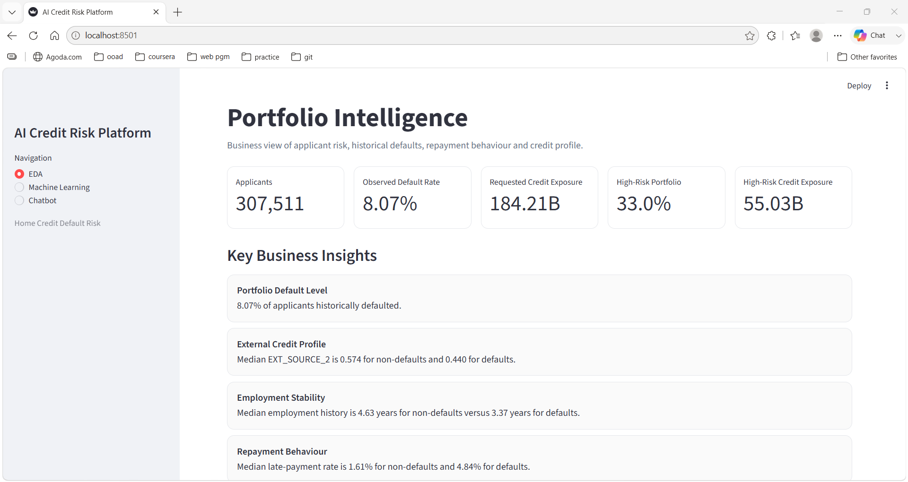
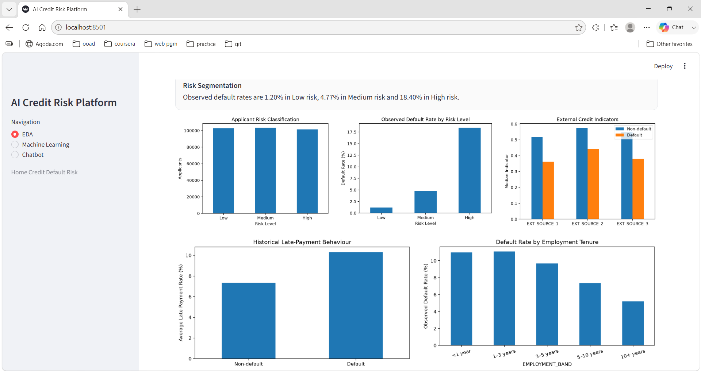
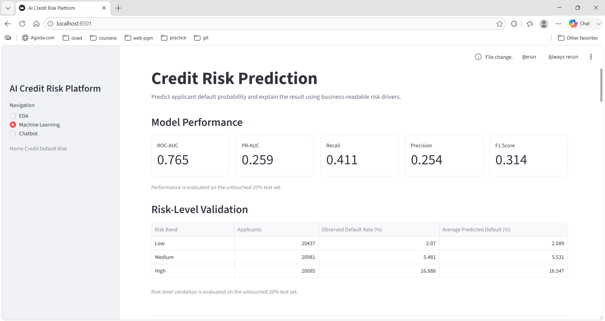
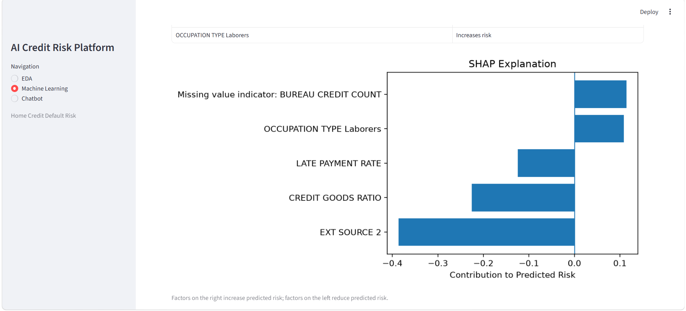
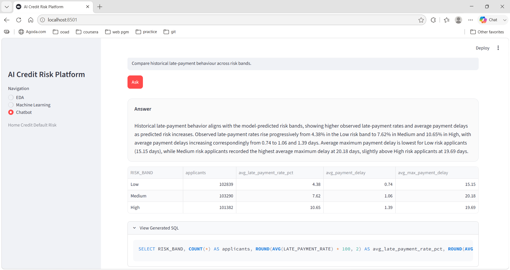
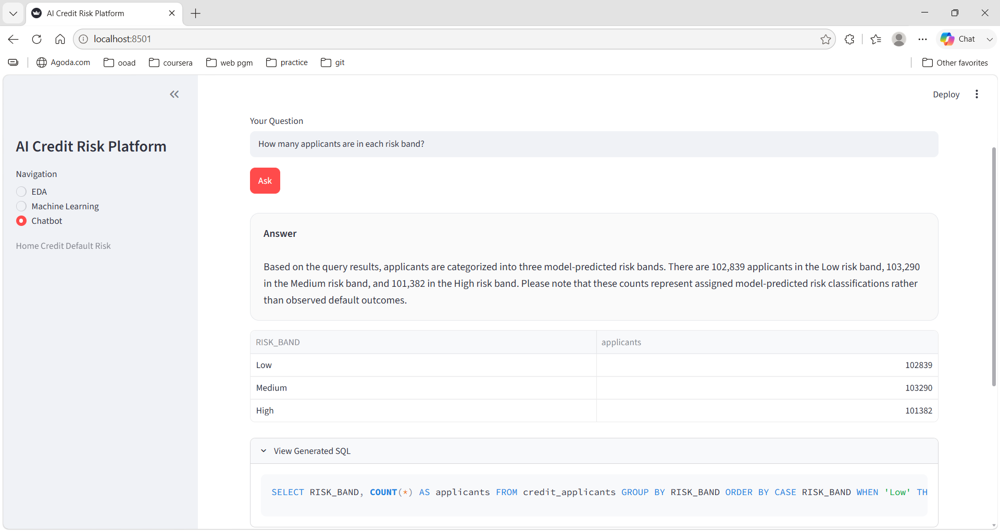
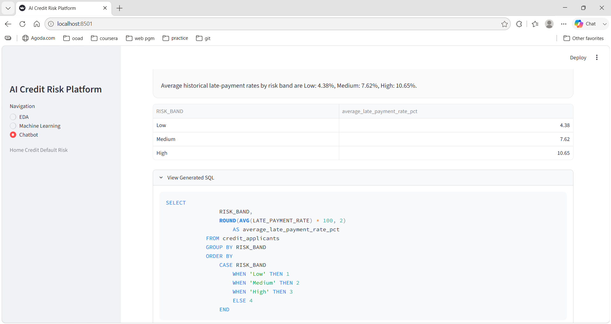

# AI Credit Risk Intelligence Platform

An end-to-end AI-powered credit risk decision-support platform built using the **Home Credit Default Risk** dataset.

The platform combines **portfolio analytics, machine learning, calibrated probability-of-default scoring, explainable AI, business-readable ML rules, natural-language-to-SQL analytics, Streamlit, SQLite, and Docker** in one modular application.

---

## Overview

Credit-risk analysis requires more than predicting whether an applicant may default. Business users also need to:

- understand portfolio-level risk patterns,
- identify higher-risk applicants,
- explain the factors influencing model outputs,
- explore analytical data without manually writing SQL,
- and run the complete solution reproducibly.

The platform addresses these needs through three user-facing modules:

- **EDA** — portfolio intelligence, business insights, data quality, repayment behaviour, employment stability and risk segmentation.
- **Machine Learning** — probability of default, risk score, Low / Medium / High risk classification, SHAP explanations and ML-derived business rules.
- **Chatbot** — natural-language portfolio questions translated into validated SQL and returned as readable business answers.

> The application is designed as a **credit-risk decision-support platform**, not as an autonomous loan approval or rejection engine.

---

## Key Capabilities

| Area | Capability |
|---|---|
| Data Preparation | Application, bureau and installment data integrated at applicant level |
| EDA | Dataset summary, data quality, feature categorization, business insights and charts |
| Default Prediction | XGBoost probability-of-default model |
| Class Imbalance | Stratified sampling and dynamic `scale_pos_weight` |
| Probability Calibration | Platt / sigmoid calibration |
| Operating Threshold | Selected on calibration data using F1 optimization |
| Risk Segmentation | Low, Medium and High model-derived risk bands |
| Explainability | Local and global SHAP |
| Business Rules | Interpretable patterns derived from a shallow surrogate tree |
| Talk-to-Data | Gemini-powered natural-language-to-SQL analytics |
| SQL Safety | SQLGlot validation and read-only SQLite execution |
| Conversation Context | Latest three analytical turns retained |
| Query Resilience | Deterministic SQL fallback for five core analytical questions |
| User Interface | Streamlit |
| Deployment | Docker and Docker Compose |

---

## Dataset

The project uses the **Home Credit Default Risk** dataset.

Dataset source:

[Home Credit Default Risk — Kaggle](https://www.kaggle.com/competitions/home-credit-default-risk/data)

### Source Files

```text
data/
├── application_train.csv
├── application_test.csv
├── bureau.csv
└── installments_payments.csv
```

### Source Table Roles

| Table | Purpose |
|---|---|
| `application_train.csv` | Applicant, financial and historical default information |
| `application_test.csv` | Unlabelled application records from the supplied source |
| `bureau.csv` | Historical external credit information |
| `installments_payments.csv` | Historical installment and repayment behaviour |

The raw dataset is excluded from GitHub.

---

## Analytical Dataset

The bureau and installment datasets contain multiple historical rows for the same applicant.

These records are aggregated using:

```text
SK_ID_CURR
```

before joining to the applicant-level application data.

The analytical grain is therefore:

```text
One row = One applicant
```

### Final Analytical Dataset

| Property | Value |
|---|---:|
| Applicants | 307,511 |
| Analytical Fields | 140 |
| Unique Applicants | 307,511 |
| Duplicate Applicants | 0 |
| Historical Default Rate | 8.07% |

Generated analytical dataset:

```text
data/credit_applicants.parquet
```

The same applicant-level analytical layer supports EDA, model development and SQLite portfolio analytics.

---

## Data Preparation and Feature Engineering

The processing workflow integrates application, bureau and repayment evidence into one applicant-level dataset.

```text
Home Credit Source Tables
        ↓
File Validation
        ↓
Cleaning
        ↓
Bureau Aggregation
        ↓
Installment Aggregation
        ↓
Applicant-Level Merge
        ↓
Feature Engineering
        ↓
credit_applicants.parquet
```

### Data Quality Handling

The pipeline includes:

- missing-value analysis,
- duplicate-applicant validation,
- numeric and categorical feature categorization,
- sentinel-value handling,
- median numeric imputation,
- categorical `"Unknown"` handling,
- missing-value indicators,
- one-hot encoding with safe unseen-category handling.

The Home Credit sentinel:

```text
DAYS_EMPLOYED = 365243
```

is treated as missing before employment duration is derived.

### Representative Engineered Features

```text
CREDIT_INCOME_RATIO =
AMT_CREDIT / AMT_INCOME_TOTAL
```

```text
ANNUITY_INCOME_RATIO =
AMT_ANNUITY / AMT_INCOME_TOTAL
```

```text
CREDIT_GOODS_RATIO =
AMT_CREDIT / AMT_GOODS_PRICE
```

```text
AGE_YEARS =
|DAYS_BIRTH| / 365.25
```

```text
EMPLOYMENT_YEARS =
|DAYS_EMPLOYED| / 365.25
```

```text
EMPLOYMENT_AGE_RATIO =
EMPLOYMENT_YEARS / AGE_YEARS
```

### Bureau Aggregates

Representative bureau features include:

- historical credit count,
- active credit count,
- closed credit count,
- overdue credit count,
- total bureau credit,
- outstanding bureau debt,
- historical overdue amount.

### Repayment Aggregates

Representative repayment features include:

- installment count,
- average payment delay,
- maximum payment delay,
- historical late-payment rate,
- average payment ratio.

---

# Exploratory Data Analysis

The EDA module was designed to answer **business-relevant credit-risk questions before modelling**, rather than only presenting descriptive statistics.

The analysis covers:

- portfolio composition,
- historical default behaviour,
- external credit indicators,
- financial exposure,
- repayment behaviour,
- employment stability,
- model-derived risk segmentation.

---

## EDA Output — Portfolio Intelligence



The dashboard starts with business-level KPIs so that model outputs remain connected to portfolio impact.

### Portfolio KPIs

| KPI | Value |
|---|---:|
| Applicants | **307,511** |
| Observed Default Rate | **8.07%** |
| Requested Credit Exposure | **184.21B** |
| High-Risk Portfolio | **33.0%** |
| High-Risk Credit Exposure | **55.03B** |

### Key Business Insights

#### Historical Default Level

Approximately **8.07%** of applicants historically defaulted.

This establishes default as a minority outcome and motivates imbalance-aware model training and evaluation.

#### External Credit Profile

Median `EXT_SOURCE_2`:

```text
Non-default ≈ 0.574
Default     ≈ 0.440
```

Historical defaulters show weaker external credit indicators, supporting their importance in the predictive layer.

#### Employment Stability

Median employment duration:

```text
Non-default ≈ 4.63 years
Default     ≈ 3.37 years
```

Employment stability therefore contributes useful risk context.

#### Repayment Behaviour

Median late-payment rate:

```text
Non-default ≈ 1.61%
Default     ≈ 4.84%
```

Historical repayment behaviour provides an important behavioural signal beyond application-level financial information.

---

## EDA Output — Business Visual Analysis



The EDA dashboard contains five principal visualizations.

### 1. Applicant Risk Classification

Shows how the scored portfolio is distributed across:

```text
Low
Medium
High
```

model-derived risk segments.

### 2. Observed Default Rate by Risk Level

Evaluates whether higher model-risk segments correspond to progressively higher observed historical default behaviour.

### 3. External Credit Indicators

Compares external credit indicators between historical default and non-default applicants.

Lower external indicators are associated with comparatively higher historical default behaviour.

### 4. Historical Late-Payment Behaviour

Compares repayment behaviour across historical outcomes.

Historical defaulters show higher late-payment behaviour.

### 5. Default Rate by Employment Tenure

Examines how observed default behaviour varies with employment stability.

Longer employment tenure is associated with lower observed default rates.

---

# Machine Learning Layer

The prediction task is binary classification:

```text
TARGET = 0 → Non-default
TARGET = 1 → Default
```

---

## Model Selection

The final predictive model is:

```text
XGBoost Classifier
```

XGBoost was selected because the problem contains:

- structured tabular credit data,
- mixed numeric and categorical attributes,
- non-linear relationships,
- interactions between financial and behavioural variables,
- missing information,
- strong class imbalance,
- and a requirement for explainable predictions.

Its tree-based architecture also integrates naturally with SHAP.

---

## Model Feature Strategy

The model uses a curated subset of analytical features rather than automatically consuming every available field.

Feature selection is based on:

- prediction-time availability,
- business relevance,
- credit-risk coverage,
- data quality,
- interpretability,
- representation across application, bureau and repayment information.

The full analytical dataset remains available for EDA and Talk-to-Data analytics.

---

## Model Preprocessing

### Numeric Features

```text
Median Imputation
+
Missing-Value Indicators
```

Missing-value indicators allow the model to learn whether missing information itself contributes predictive signal.

### Categorical Features

```text
Missing Value → "Unknown"
One-Hot Encoding
handle_unknown = ignore
```

This keeps training and inference transformations consistent.

---

## Train, Calibration and Test Strategy

The labelled dataset is divided using stratified sampling.

| Split | Purpose |
|---|---|
| 70% | XGBoost training |
| 10% | Probability calibration, operating-threshold selection, risk-band definition and explanatory feature selection |
| 20% | Final untouched model evaluation |

The final test set does not influence:

- model fitting,
- probability calibration,
- operating-threshold selection,
- explanatory feature selection.

---

## Handling Class Imbalance

Historical defaults represent approximately **8.07%** of the labelled portfolio.

The implementation handles imbalance using multiple mechanisms.

### Stratified Sampling

The class distribution is preserved across train, calibration and test partitions.

### XGBoost Class Weighting

The minority default class receives additional learning importance using:

```text
scale_pos_weight =
Number of Non-default Applicants
/
Number of Default Applicants
```

This strengthens default-class learning without generating synthetic applicant profiles.

### Operating Threshold

The application does not assume a generic `0.50` threshold.

Instead, the operating threshold is selected only on the calibration split by maximizing F1.

```text
Operating Threshold = 0.1562
```

The selected threshold is then frozen before final test-set evaluation.

---

## Probability Calibration

Raw XGBoost decision scores are calibrated using:

```text
Platt / Sigmoid Calibration
```

on the dedicated calibration partition.

The calibrated probability is stored as:

```text
MODEL_PD
```

and becomes the user-facing probability of default.

---

# Model Evaluation

## Final ML Output



All final metrics are calculated on the untouched 20% test set.

| Metric | Result |
|---|---:|
| ROC-AUC | **0.7645** |
| PR-AUC | **0.2586** |
| PR-AUC Lift | **3.20×** |
| Precision | **0.2541** |
| Recall | **0.4109** |
| F1 Score | **0.3140** |
| Brier Score | **0.0672** |
| Operating Threshold | **0.1562** |

### Metric Interpretation

- **ROC-AUC** measures overall risk-ranking ability.
- **PR-AUC** focuses evaluation on the minority default class.
- **Precision** measures the correctness of positive default predictions.
- **Recall** measures how many actual historical defaults are identified.
- **F1 Score** balances precision and recall at the selected operating threshold.
- **Brier Score** evaluates the quality of calibrated probability estimates.

---

## Risk-Level Validation

| Risk Band | Applicants | Observed Default Rate | Average Predicted Default |
|---|---:|---:|---:|
| Low | 20,437 | **2.070%** | **2.089%** |
| Medium | 20,981 | **5.481%** | **5.531%** |
| High | 20,085 | **16.888%** | **16.547%** |

Observed default behaviour increases consistently from Low to Medium to High.

The close alignment between observed and predicted rates also supports the interpretation of calibrated model probabilities.

---

## Risk Score

The model risk score is:

```text
Risk Score = Probability of Default × 100
```

Example:

```text
Probability of Default = 6.62%
Risk Score = 6.6 / 100
```

This is a model-estimated risk score and does not replicate an external bureau score.

---

## Risk Classification

Applicants are grouped into:

```text
Low
Medium
High
```

Risk-band thresholds are derived from the calibrated probability distribution rather than manually defined approval-policy rules.

---

# Explainable AI

The platform uses:

```text
SHAP
```

to make model predictions understandable.

---

## Local SHAP Output



For an individual applicant, the Machine Learning page presents:

- probability of default,
- risk score,
- risk classification,
- applicant profile,
- leading prediction drivers,
- direction of each driver's impact,
- local SHAP contribution chart.

For the demonstrated applicant:

```text
SK_ID_CURR = 100006
Probability of Default = 6.62%
Risk Score = 6.6 / 100
Risk Classification = Medium
```

Risk-reducing drivers include:

```text
EXT_SOURCE_2
CREDIT_GOODS_RATIO
LATE_PAYMENT_RATE
```

Risk-increasing drivers include:

```text
Missing BUREAU_CREDIT_COUNT
OCCUPATION_TYPE = Laborers
```

The interface translates SHAP contributions into:

```text
Increases risk
```

or:

```text
Reduces risk
```

for non-technical interpretation.

---

## Global SHAP Output


Global SHAP identifies the features with the strongest overall influence across model predictions.

Leading global drivers include:

```text
EXT_SOURCE_2
EXT_SOURCE_3
EXT_SOURCE_1
CREDIT_GOODS_RATIO
BUREAU_DEBT_SUM
AMT_GOODS_PRICE
AMT_ANNUITY
LATE_PAYMENT_RATE
AGE_YEARS
EMPLOYMENT_YEARS
```

The chart uses **average absolute SHAP contribution**, so it measures strength of influence rather than universal direction.

Global explanatory feature selection is performed using calibration data, preserving the final test set for evaluation.

---

# ML-Derived Business Rules

The final applicant prediction continues to come from the calibrated XGBoost model.

A shallow surrogate decision tree approximates recurring XGBoost probability behaviour.

```text
XGBoost Behaviour
        ↓
Influential Features
        ↓
Shallow Surrogate Tree
        ↓
Readable IF / THEN Rules
```

### Sample Rule

```text
IF EXT_SOURCE_3 > 0.309
AND EXT_SOURCE_2 <= 0.406
AND EXT_SOURCE_3 <= 0.536
THEN approximate Probability of Default = 14.57%
```

The rule is an interpretable approximation of model behaviour. Final applicant predictions remain generated by XGBoost.

---

# Talk-to-Data System

The application includes a natural-language analytics assistant powered by **Gemini** through the Google GenAI SDK.

Users can explore the credit portfolio in plain English.

---

## Five Core Query Patterns

```text
What is the observed default rate?
```

```text
How many applicants are in each risk band?
```

```text
What is the observed default rate for each risk band?
```

```text
Compare historical late-payment behaviour across risk bands.
```

```text
What is the average requested credit amount by risk band?
```

Custom analytical questions are also supported.

---

## NL-to-SQL Workflow

```text
Natural-Language Question
          ↓
Schema-Grounded Prompt
          ↓
Gemini
          ↓
SQL Generation
          ↓
SQL Validation
          ↓
Read-Only SQLite Execution
          ↓
Query Result
          ↓
Business-Readable Answer
```

---

## Prompt Engineering

The prompt includes:

- approved analytical schema,
- business definitions of important fields,
- SQL-generation constraints,
- distinction between observed and predicted risk,
- five representative few-shot query patterns,
- recent conversation context.

Two fields are explicitly separated:

```text
TARGET
```

represents the **observed historical default outcome**.

```text
MODEL_PD
```

represents the **model-predicted probability of default**.

This prevents observed outcomes and model probabilities from being mixed during analysis.

---

## Conversation Context

The chatbot retains the latest **three question-answer turns**.

This supports follow-up analytical questions while keeping the prompt compact and token-efficient.

---

## SQL Validation and Hallucination Control

Generated SQL is validated before database execution.

The validation layer enforces:

- exactly one SQL statement,
- `SELECT`-only access,
- approved analytical table,
- approved schema columns,
- no destructive operations,
- read-only SQLite execution.

Blocked operations include:

```text
INSERT
UPDATE
DELETE
DROP
CREATE
ALTER
```

The chatbot operates against:

```text
credit_applicants
```

inside:

```text
data/credit_risk.db
```

Business responses are generated only after validated SQL executes successfully and are grounded in returned query values.

---

## Controlled SQL Repair

If generated SQL does not pass validation or execution, one bounded correction attempt is permitted.

The repair stage receives:

- the original business question,
- generated SQL,
- validation or execution feedback,
- approved schema.

There is no unrestricted autonomous retry loop.

---

# Talk-to-Data Outputs

## Late-Payment Analysis



Example question:

```text
Compare historical late-payment behaviour across risk bands.
```

The output demonstrates:

- natural-language input,
- generated SQL,
- SQLite execution,
- result table,
- business-readable interpretation.

Example result:

| Risk Band | Average Late-Payment Rate |
|---|---:|
| Low | **4.38%** |
| Medium | **7.62%** |
| High | **10.65%** |

---

## Risk-Band Applicant Query



Example question:

```text
How many applicants are in each risk band?
```

Result:

| Risk Band | Applicants |
|---|---:|
| Low | **102,839** |
| Medium | **103,290** |
| High | **101,382** |

The interface also exposes the generated SQL for auditability.

---

## Deterministic SQL Fallback



The five core analytical questions also have prevalidated SQL templates.

```text
Core Question
      ↓
Prevalidated SQL
      ↓
SQLite
      ↓
Deterministic Business Answer
```

This complements the flexible Gemini path with deterministic execution for the five principal business questions.

No second LLM provider or additional dependency is introduced.

---

## Prompt and Token Optimization

The Talk-to-Data workflow reduces unnecessary LLM context through:

- curated schema definitions,
- concise business field descriptions,
- reusable few-shot examples,
- latest three conversation turns only,
- database-side aggregation,
- one bounded repair attempt,
- result-level summarization.

The complete 307,511-row dataset is never sent directly to the language model.

---

# User Interface

The Streamlit application contains three principal sections.

## EDA

Provides:

- portfolio KPIs,
- dataset summary,
- data quality,
- business insights,
- five analytical charts.

## Machine Learning

Provides:

- final test-set model performance,
- risk-band validation,
- applicant lookup,
- probability of default,
- risk score,
- Low / Medium / High classification,
- applicant profile,
- local SHAP explanation,
- global SHAP importance,
- ML-derived business rules.

## Chatbot

Provides:

- five ready-made analytical questions,
- custom natural-language questions,
- generated SQL,
- validated database execution,
- result tables,
- business-readable answers,
- deterministic SQL fallback for core analytical questions.

---

# System Architecture

```text
                       HOME CREDIT SOURCE DATA
                                  │
                                  ▼
                      Validation & Data Loading
                                  │
                                  ▼
                  Cleaning + Aggregation + Features
                                  │
                                  ▼
                    Applicant-Level Analytical Dataset
                                  │
                 ┌────────────────┴────────────────┐
                 │                                 │
                 ▼                                 ▼
                EDA                           ML Pipeline
                                                  │
                                                  ▼
                                               XGBoost
                                                  │
                              ┌───────────────────┴──────────────────┐
                              │                                      │
                              ▼                                      ▼
                       Platt Calibration                            SHAP
                              │                                      │
                              ▼                                      ▼
                    Probability of Default                    Explainability
                              │
                              ▼
                     Risk Score + Risk Bands
                              │
                ┌─────────────┴─────────────────────────────┐
                │                                           │
                ▼                                           ▼
         Streamlit ML Interface                      SQLite Database
                                                          │
                                    ┌─────────────────────┴─────────────────────┐
                                    │                                           │
                                    ▼                                           ▼
                             Gemini NL-to-SQL                           Core SQL Fallback
                                    │                                           │
                                    ▼                                           │
                               SQL Validation                                  │
                                    └─────────────────────┬─────────────────────┘
                                                          ▼
                                                 Read-Only Execution
                                                          │
                                                          ▼
                                                 Business-Readable Answer
                                                          │
                                                          ▼
                                                   Streamlit Chatbot
```

---

# Major Design Decisions

| Decision | Selected Approach | Rationale |
|---|---|---|
| Analytical Grain | One applicant per row | Prevents duplication from one-to-many historical records |
| Predictive Model | XGBoost | Suitable for structured credit data and non-linear interactions |
| Feature Strategy | Curated interpretable subset | Balances predictive coverage, availability and explainability |
| Class Imbalance | Stratification + `scale_pos_weight` | Strengthens minority-default learning without synthetic records |
| Data Split | 70 / 10 / 20 | Separates training, calibration and final evaluation |
| Probability Calibration | Platt calibration | Produces interpretable user-facing default probabilities |
| Operating Threshold | Calibration-set F1 optimization | Creates an imbalance-aware classification operating point |
| Risk Bands | Calibration-distribution thresholds | Provides relative portfolio segmentation |
| Explainability | SHAP | Supports local and global explanations |
| Business Rules | Shallow surrogate tree | Converts recurring model patterns into readable rules |
| Analytical Storage | SQLite | Lightweight and reproducible |
| LLM | Gemini | Supports schema-grounded NL-to-SQL |
| SQL Validation | SQLGlot | Enforces safe analytical SQL |
| Query Resilience | Prevalidated SQL templates | Provides deterministic execution for core questions |
| Interface | Streamlit | Lightweight multi-section application |
| Deployment | Docker Compose | Reproducible end-to-end execution |

---

# Technology Stack

| Layer | Technologies |
|---|---|
| Programming | Python |
| Data Processing | Pandas, NumPy |
| Machine Learning | Scikit-learn, XGBoost |
| Explainability | SHAP |
| Storage | Parquet, SQLite |
| SQL Validation | SQLGlot |
| Generative AI | Gemini API, Google GenAI SDK |
| User Interface | Streamlit |
| Artifact Persistence | Joblib |
| Deployment | Docker, Docker Compose |
| Version Control | Git, GitHub |

---

# Project Structure

```text
credit_risk_platform/
├── data/
├── documents/
│   ├── project_presentation.pdf
│   └── screenshots/
│       ├── eda_overview.png
│       ├── eda_charts.png
│       ├── ml_metrics.png
│       ├── local_shap.png
│       ├── global_shap.png
│       ├── chatbot_late_payment.png
│       ├── chatbot_risk_band.png
│       └── chatbot_fallback.png
├── notebooks/
│   ├── eda.ipynb
│   └── eda.py
├── src/
│   ├── data/
│   │   ├── loader.py
│   │   └── preprocessor.py
│   ├── ml/
│   │   ├── train.py
│   │   ├── predict.py
│   │   └── evaluate.py
│   ├── talk_to_data/
│   │   ├── nl_to_sql.py
│   │   ├── query_runner.py
│   │   └── prompt_templates.py
│   └── utils/
│       ├── logger.py
│       ├── config.py
│       ├── helpers.py
│       └── docker_utils.py
├── sql/
│   └── schema.sql
├── models/
│   ├── xgboost_model.joblib
│   ├── preprocessor.joblib
│   ├── model_metadata.joblib
│   └── surrogate_model.joblib
├── app.py
├── Dockerfile
├── docker-compose.yml
├── requirements.txt
├── .env.example
├── .gitignore
└── README.md
```

---

# Installation

## 1. Clone the Repository

```bash
git clone https://github.com/Rajyasri24/AI-Credit-Risk-Platform.git
cd AI-Credit-Risk-Platform
```

## 2. Create a Virtual Environment

### Windows

```bash
py -3.11 -m venv .venv
.venv\Scripts\activate
```

### Linux / macOS

```bash
python3.11 -m venv .venv
source .venv/bin/activate
```

Install dependencies:

```bash
pip install -r requirements.txt
```

---

# Dataset Setup

Place the required Home Credit source files inside:

```text
data/
```

Required files:

```text
application_train.csv
application_test.csv
bureau.csv
installments_payments.csv
```

The raw dataset remains outside Git.

---

# Environment Configuration

Create:

```text
.env
```

from:

```text
.env.example
```

Configure:

```env
GEMINI_API_KEY=your_api_key
LLM_MODEL=gemini-3.6-flash
```

The actual `.env` file remains outside version control.

---

# Run Locally

## 1. Build the Analytical Dataset

```bash
python -m src.data.preprocessor
```

Generated:

```text
data/credit_applicants.parquet
```

## 2. Train the Model

```bash
python -m src.ml.train
```

Generated:

```text
models/xgboost_model.joblib
models/preprocessor.joblib
models/model_metadata.joblib
models/surrogate_model.joblib
```

## 3. Build the Analytical Database

```bash
python -m src.talk_to_data.query_runner
```

Generated:

```text
data/credit_risk.db
```

## 4. Start the Application

```bash
streamlit run app.py
```

Open:

```text
http://localhost:8501
```

---

# Dockerized Deployment

The full platform can be run with Docker Compose.

Ensure:

- Home Credit source files are available under `data/`,
- `.env` contains the Gemini configuration,
- saved model artifacts are available under `models/`.

Run:

```bash
docker compose up --build
```

Open:

```text
http://localhost:8501
```

Stop:

```bash
docker compose down
```

---

# Generated Artifacts

## Processed Data

```text
data/credit_applicants.parquet
data/credit_risk.db
```

## Model Artifacts

```text
models/xgboost_model.joblib
models/preprocessor.joblib
models/model_metadata.joblib
models/surrogate_model.joblib
```

---

# Scope Boundaries and Production Improvements

The current implementation is designed as a lightweight and reproducible credit-risk decision-support platform for the supplied Home Credit dataset.

Natural production extensions include:

- governed real-time application and bureau integrations,
- institution-specific decision thresholds,
- data-drift and model-drift monitoring,
- governed model retraining,
- model registry integration,
- authentication and role-based access,
- persistent audit logging,
- managed analytical database infrastructure,
- service-level observability and monitoring.

---

# Presentation

The final use-case presentation with application output screenshots is available at:

```text
documents/project_presentation.pdf
```

---

# Repository

```text
https://github.com/Rajyasri24/AI-Credit-Risk-Platform
```

---

# Author

**Rajyasri S**  
M.Sc. Data Science  
CHRIST (Deemed to be University), Bengaluru
